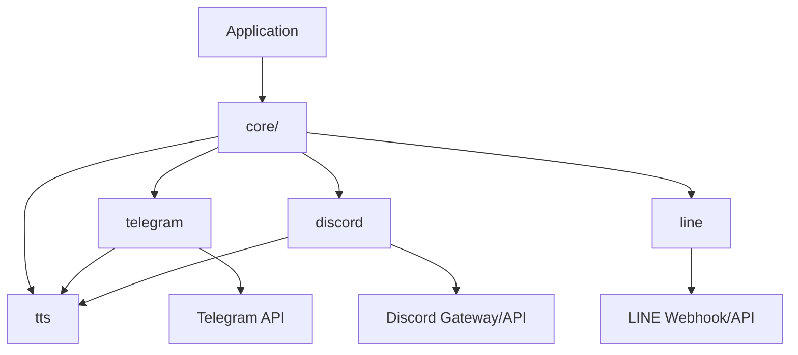

> [!NOTE]
> This README was generated by [SKILL](https://github.com/agenvoy/skill-readme-generate), get the ZH version from [here](./core/doc/README.zh.md).

***

<strong>BUILD BOTS THAT FIT EVERY CHAT PLATFORM</strong>

***

> A Go chat-bot library with a core layout, unified replies, and native multi-platform interactions

## Table of Contents
- [Features](#features)
- [Architecture](#architecture)
- [License](#license)
- [Author](#author)

## Features

> `go get github.com/pardnchiu/go-bot` · [Documentation](./doc/doc.md)

- **core/ package layout** — Telegram, Discord, LINE, and TTS live under `core/`, so platform adapters and docs share one import root.
- **Platform-native lifecycles** — Telegram polling, Discord Gateway, and LINE webhooks keep each platform’s transport model behind consistent bot APIs.
- **Synchronous reply contract** — Register one `Reply` handler; a non-empty return value is sent as the reply to the triggering message.
- **Interaction primitives** — Telegram keyboards and ForceReply plus Discord select menus and modals route user input back into the same handler model.
- **Media without boilerplate** — Send and persist platform media with streaming uploads, size caps, UUID filenames, and contextual cancellation.

## Architecture

> [Full Architecture](./doc/architecture.md)

## License

This project is licensed under the [MIT LICENSE](LICENSE).

## Author

<h4 style="padding-top: 0">邱敬幃 Pardn Chiu</h4>

<a href="mailto:hi@pardn.io">hi@pardn.io</a> 
<a href="https://www.linkedin.com/in/pardnchiu">https://www.linkedin.com/in/pardnchiu</a>

***

©️ 2026 [邱敬幃 Pardn Chiu](https://www.linkedin.com/in/pardnchiu)
