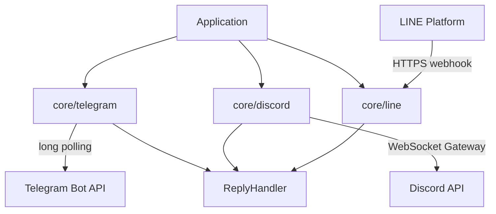

Last updated: 2026-10-06

> [!NOTE]
> This README was generated by [SKILL](https://github.com/agenvoy/skill-readme-generate), get the ZH version from [here](./doc/README.zh.md).

***

<strong>BUILD BOTS THAT FIT EVERY CHAT PLATFORM</strong>

***

> A Go multi-platform chat bot library with Telegram, Discord, and LINE adapters, one reply handler, and native interactions

## Table of Contents

- [Features](#features)
- [Architecture](#architecture)
- [License](#license)
- [Author](#author)

## Features

> `go get github.com/pardnchiu/go-bot` · [Documentation](./doc/doc.md)

- **Synchronous reply contract** — Register one `Reply` handler per platform; a non-empty return value replies to the triggering message, and the library recovers handler panics without dropping the connection.
- **Platform-native transports** — Telegram long polling and the Discord Gateway connect outbound and run behind NAT, while LINE uses a built-in signature-verifying webhook server, all under the same `New`/`Start`/`Close` lifecycle.
- **Interactions flow back to one handler** — Telegram inline keyboards and ForceReply plus Discord select menus and the button-to-modal flow deliver user picks and answers to the same handler as `Input`.
- **Debounced "thinking" status** — `SendStatus` reacts to the source message and edits a single status message at most once per second, and `FinishStatus` clears both the reaction and the message to stay within platform rate limits.
- **Capped media persistence** — Attachment downloads enforce 20/25/50 MiB per-platform caps and write atomically under UUID filenames, while uploads stream straight from disk.

## Architecture

> [Full Architecture](./doc/architecture.md)

```mermaid
graph TB
    App[Application] --> TG[core/telegram]
    App --> DC[core/discord]
    App --> LN[core/line]
    TG -->|long polling| TelegramAPI[Telegram Bot API]
    DC -->|WebSocket Gateway| DiscordAPI[Discord API]
    LineAPI[LINE Platform] -->|HTTPS webhook| LN
    TG --> Handler[ReplyHandler]
    DC --> Handler
    LN --> Handler
```

## License

This project is licensed under the [MIT LICENSE](LICENSE).

## Author

Just [open an issue](https://github.com/pardnchiu/go-bot/issues/new) to share an idea.

***

©️ 2026 [邱敬幃 Pardn Chiu](https://www.linkedin.com/in/pardnchiu)
