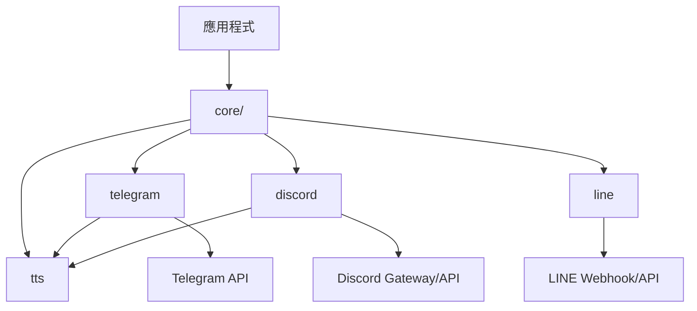

> [!NOTE]
> 此 README 由 [SKILL](https://github.com/agenvoy/skill-readme-generate) 生成，英文版請參閱 [這裡](../README.md)。

***

<strong>BUILD BOTS THAT FIT EVERY CHAT PLATFORM</strong>

***

> Go 聊天機器人函式庫，以 core/ 統一版面，支援多平台原生互動與回覆

## 目錄
- [功能特點](#功能特點)
- [架構](#架構)
- [授權](#授權)
- [Author](#author)

## 功能特點

> `go get github.com/pardnchiu/go-bot` · [完整文件](./doc.zh.md)

- **core/ 套件版面** — Telegram、Discord、LINE 與 TTS 集中在 `core/`，平台 adapter 與文件共用同一 import 根。
- **原生平台生命週期** — Telegram long polling、Discord Gateway 與 LINE webhook 各自保留正確連線模型，並提供一致 Bot API。
- **同步回覆契約** — 註冊單一 `Reply` handler，回傳非空字串時便自動回覆觸發訊息。
- **互動元件整合** — Telegram 鍵盤與 ForceReply、Discord 選單與 Modal 都回到相同 handler 輸入模型。
- **媒體處理封裝** — 以串流上傳、大小上限、UUID 檔名與可取消 Context 處理各平台媒體。

## 架構

> [完整架構](./architecture.zh.md)

## 授權

本專案採用 [MIT LICENSE](../LICENSE)。

## Author

<h4 style="padding-top: 0">邱敬幃 Pardn Chiu</h4>

<a href="mailto:hi@pardn.io">hi@pardn.io</a> 
<a href="https://www.linkedin.com/in/pardnchiu">https://www.linkedin.com/in/pardnchiu</a>

***

©️ 2026 [邱敬幃 Pardn Chiu](https://www.linkedin.com/in/pardnchiu)
