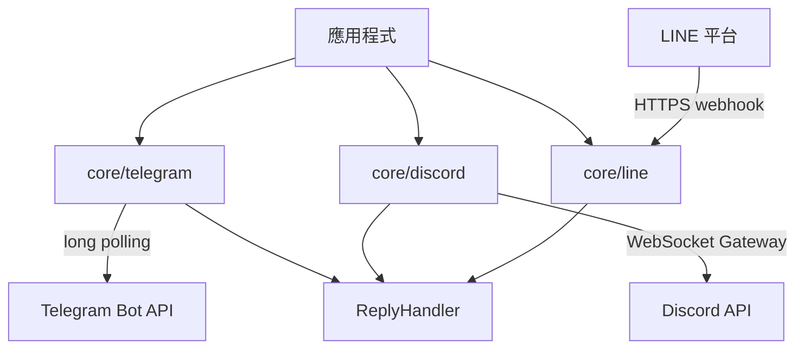

最後更新：2026-10-06

> [!NOTE]
> 此 README 由 [SKILL](https://github.com/agenvoy/skill-readme-generate) 生成，英文版請參閱 [這裡](../README.md)。

***

<strong>BUILD BOTS THAT FIT EVERY CHAT PLATFORM</strong>

***

> Go 語言多平台聊天機器人，具備 Telegram／Discord／LINE Bot、統一回覆與原生互動

## 目錄

- [功能特點](#功能特點)
- [架構](#架構)
- [授權](#授權)
- [Author](#author)

## 功能特點

> `go get github.com/pardnchiu/go-bot` · [完整文件](./doc.zh.md)

- **同步回覆契約** — 每個平台只需註冊一個 `Reply` handler，回傳非空字串即自動回覆到觸發訊息，panic 由 library 接住不會打掛連線。
- **保留平台原生傳輸** — Telegram long polling 與 Discord Gateway 皆為 outbound 可在 NAT 後執行，LINE 則以內建 webhook server 驗簽接收，三者共用 `New`／`Start`／`Close` 生命週期。
- **互動元件回流同一 handler** — Telegram inline keyboard 與 ForceReply、Discord 下拉選單與「按鈕 → Modal」流程，使用者的選擇與輸入都以 `Input` 送回原本的 handler。
- **去彈跳「思考中」狀態訊息** — `SendStatus` 在原訊息加 reaction 並以每秒最多一次的頻率編輯同一則狀態訊息，`FinishStatus` 一次清除 reaction 與訊息，避開平台 rate limit。
- **有上限的媒體落地** — 附件下載依平台套用 20／25／50 MiB 上限並以 UUID 檔名原子寫入，上傳則以檔案串流送出。

## 架構

> [完整架構](./architecture.zh.md)

```mermaid
graph TB
    App[應用程式] --> TG[core/telegram]
    App --> DC[core/discord]
    App --> LN[core/line]
    TG -->|long polling| TelegramAPI[Telegram Bot API]
    DC -->|WebSocket Gateway| DiscordAPI[Discord API]
    LineAPI[LINE 平台] -->|HTTPS webhook| LN
    TG --> Handler[ReplyHandler]
    DC --> Handler
    LN --> Handler
```

## 授權

本專案採用 [MIT LICENSE](../LICENSE)。

## Author

Just [open an issue](https://github.com/pardnchiu/go-bot/issues/new) to share an idea.

***

©️ 2026 [邱敬幃 Pardn Chiu](https://www.linkedin.com/in/pardnchiu)
