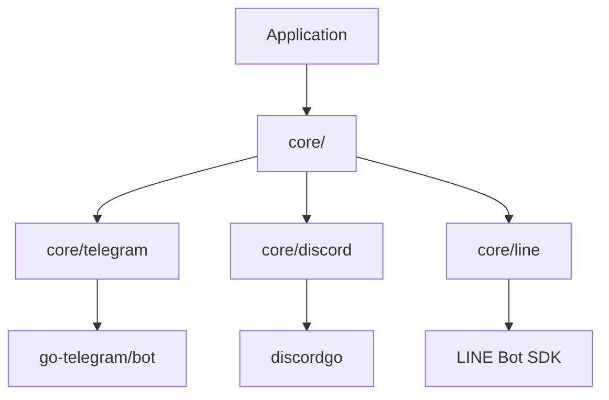
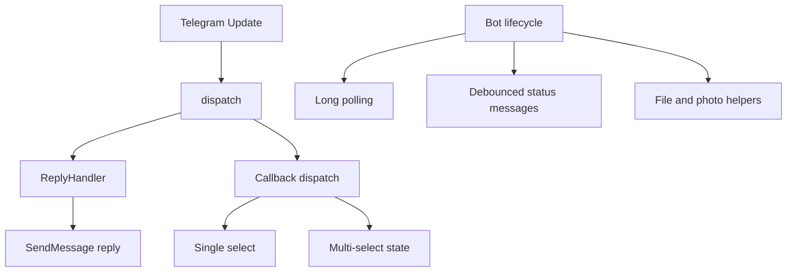
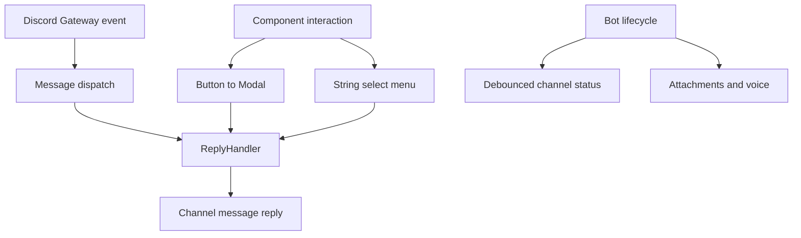
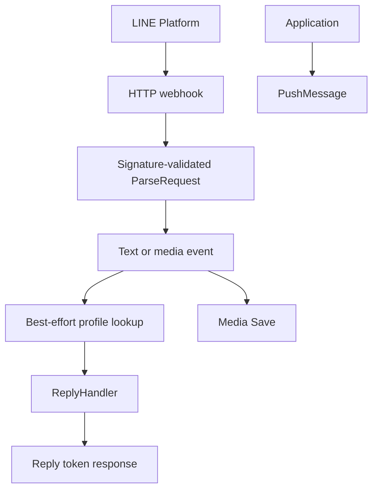
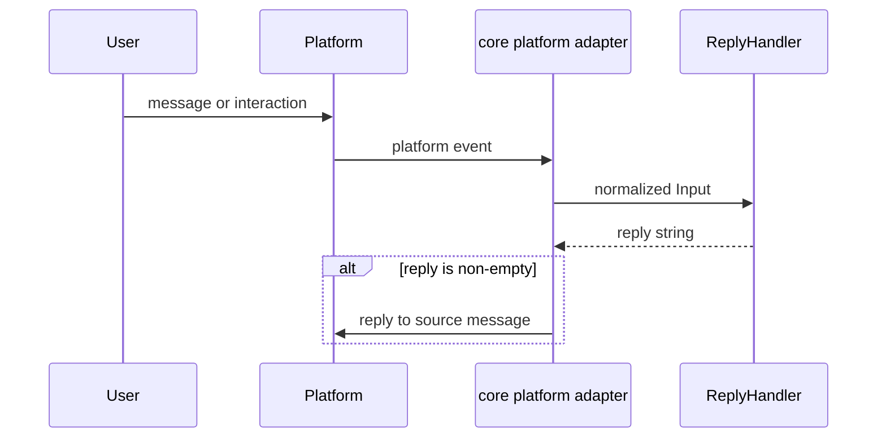
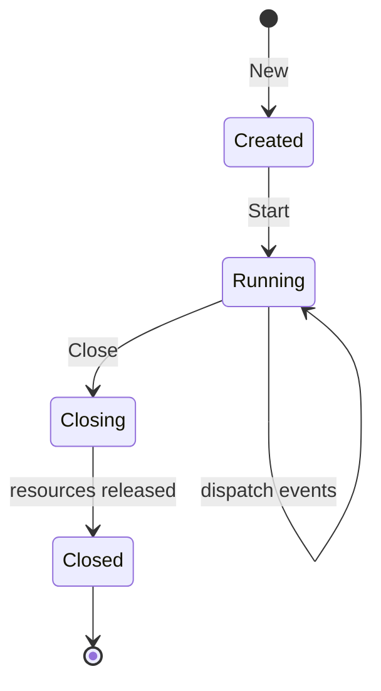

# go-bot - Architecture

> Back to [README](../README.md)

## Overview

Platform adapters now live under `core/`. Applications import `github.com/pardnchiu/go-bot/core/<platform>` and keep the same `Reply` convention across packages.

## Module: core/telegram

The Telegram adapter owns long-polling lifecycle, dispatches updates synchronously, and maps platform features to the package API.

## Module: core/discord

The Discord adapter manages a Gateway session and uses Discord-native components for interaction flows.

## Module: core/line

The LINE adapter runs an inbound HTTP webhook server and keeps the API surface limited to replies, push messages, and media persistence.

## Data Flow

## State Machine

***

©️ 2026 [邱敬幃 Pardn Chiu](https://www.linkedin.com/in/pardnchiu)
