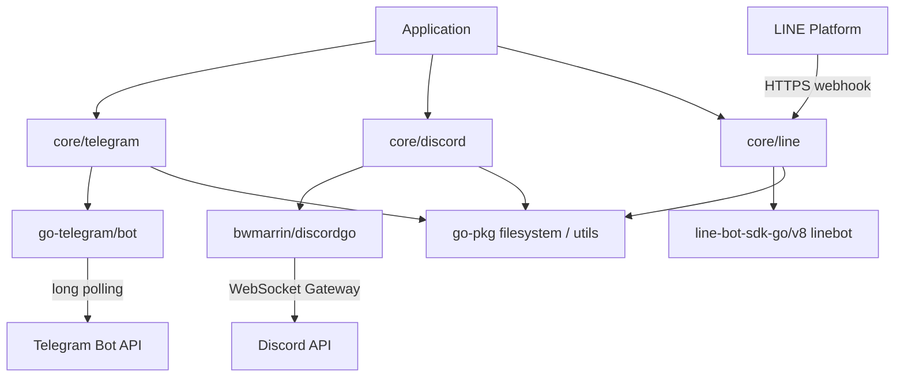
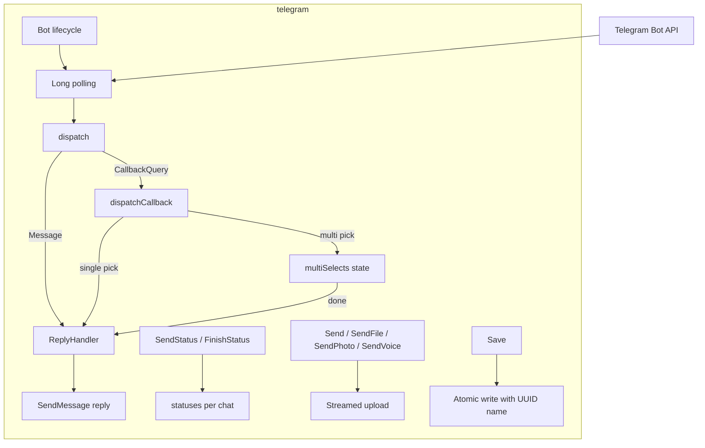
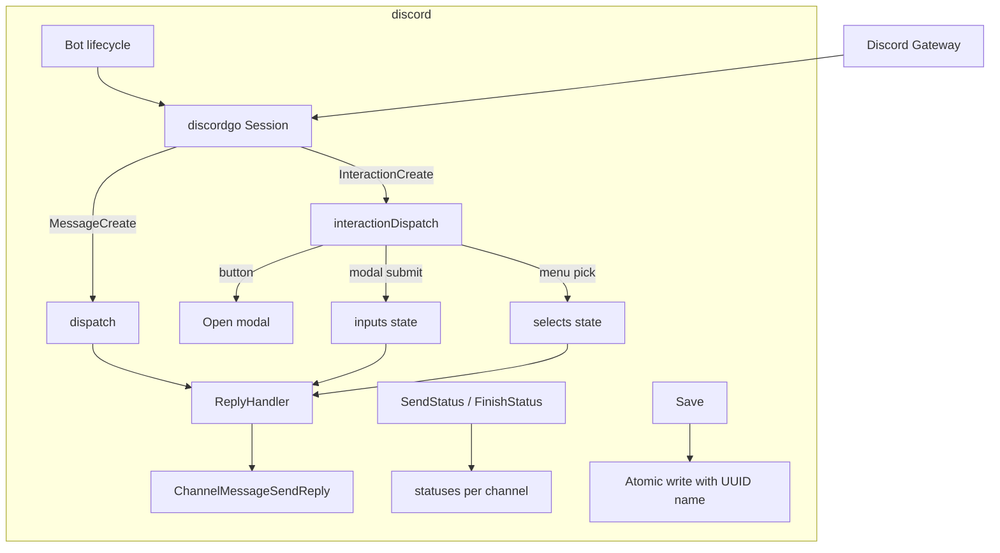
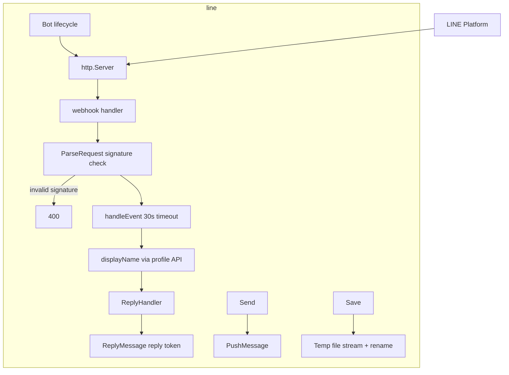
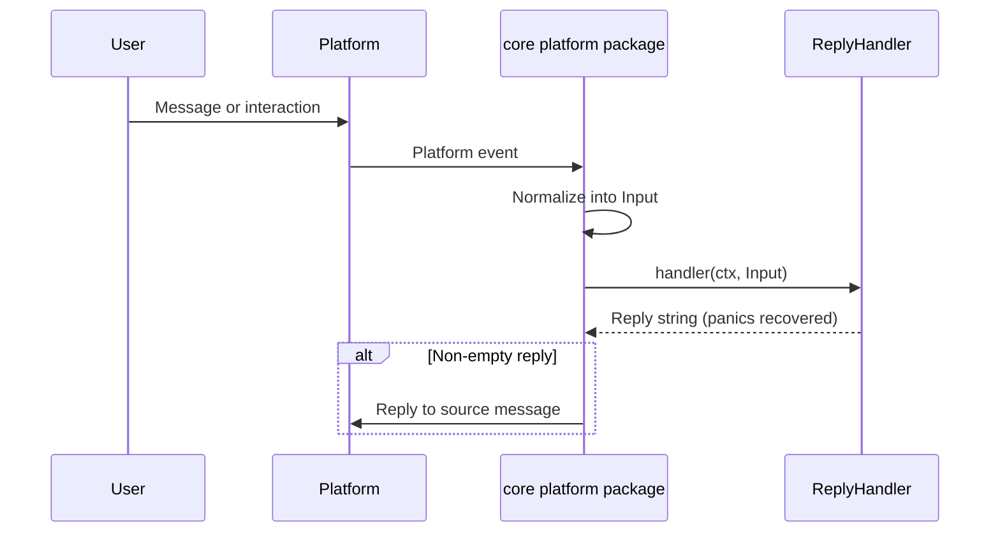
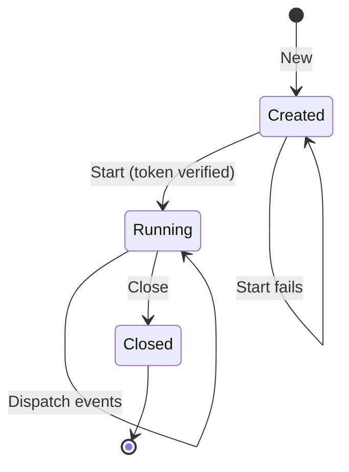
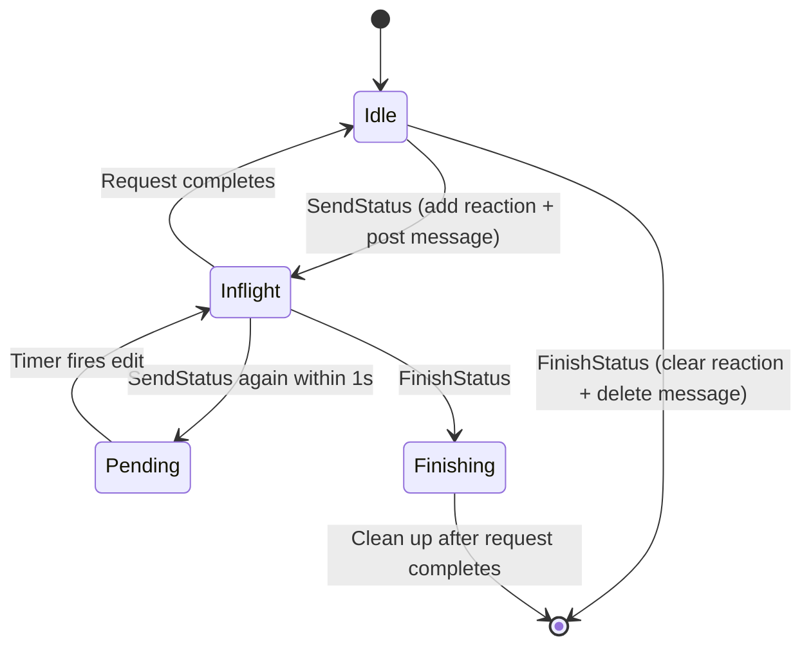

# go-bot - Architecture

Last updated: 2026-10-06

> Back to [README](../README.md)

## Overview

The three platform packages are independent and share no internal package. Only the `New`/`Start`/`Close`/`Status` lifecycle and the "`Reply(handler)` sends any non-empty return value" convention are common.

```mermaid
graph TB
    App[Application] --> TG[core/telegram]
    App --> DC[core/discord]
    App --> LN[core/line]
    TG --> TGSDK[go-telegram/bot]
    DC --> DGSDK[bwmarrin/discordgo]
    LN --> LNSDK[line-bot-sdk-go/v8 linebot]
    TG --> PKG[go-pkg filesystem / utils]
    DC --> PKG
    LN --> PKG
    TGSDK -->|long polling| TelegramAPI[Telegram Bot API]
    DGSDK -->|WebSocket Gateway| DiscordAPI[Discord API]
    LineAPI[LINE Platform] -->|HTTPS webhook| LN
```

## Module: core/telegram

The Telegram adapter owns the long-polling lifecycle, dispatches updates synchronously, and provides interactions through inline keyboards and ForceReply.

```mermaid
graph TB
    subgraph telegram
        Bot[Bot lifecycle] --> Poll[Long polling]
        Poll --> Dispatch[dispatch]
        Dispatch -->|Message| Handler[ReplyHandler]
        Dispatch -->|CallbackQuery| Callback[dispatchCallback]
        Callback -->|single pick| Handler
        Callback -->|multi pick| Multi[multiSelects state]
        Multi -->|done| Handler
        Handler --> Reply[SendMessage reply]
        Status[SendStatus / FinishStatus] --> Statuses[statuses per chat]
        Media[Send / SendFile / SendPhoto / SendVoice] --> Upload[Streamed upload]
        Save[Save] --> Disk[Atomic write with UUID name]
    end
    API[Telegram Bot API] --> Poll
```

## Module: core/discord

The Discord adapter manages the Gateway session and drives interactions with native Discord components.

```mermaid
graph TB
    subgraph discord
        Bot[Bot lifecycle] --> Session[discordgo Session]
        Session -->|MessageCreate| Dispatch[dispatch]
        Session -->|InteractionCreate| Interaction[interactionDispatch]
        Dispatch --> Handler[ReplyHandler]
        Interaction -->|button| Modal[Open modal]
        Interaction -->|modal submit| Inputs[inputs state]
        Interaction -->|menu pick| Selects[selects state]
        Inputs --> Handler
        Selects --> Handler
        Handler --> Reply[ChannelMessageSendReply]
        Status[SendStatus / FinishStatus] --> Statuses[statuses per channel]
        Save[Save] --> Disk[Atomic write with UUID name]
    end
    Gateway[Discord Gateway] --> Session
```

## Module: core/line

The LINE adapter runs an inbound HTTP webhook server and limits its scope to replies, PushMessage, and media persistence.

```mermaid
graph TB
    subgraph line
        Bot[Bot lifecycle] --> Server[http.Server]
        Server --> Webhook[webhook handler]
        Webhook --> Parse[ParseRequest signature check]
        Parse -->|invalid signature| R400[400]
        Parse --> Event[handleEvent 30s timeout]
        Event --> Profile[displayName via profile API]
        Profile --> Handler[ReplyHandler]
        Handler --> Reply[ReplyMessage reply token]
        Send[Send] --> Push[PushMessage]
        Save[Save] --> Disk[Temp file stream + rename]
    end
    LINE[LINE Platform] --> Server
```

## Data Flow

```mermaid
sequenceDiagram
    participant User
    participant Platform
    participant Adapter as core platform package
    participant Handler as ReplyHandler
    User->>Platform: Message or interaction
    Platform->>Adapter: Platform event
    Adapter->>Adapter: Normalize into Input
    Adapter->>Handler: handler(ctx, Input)
    Handler-->>Adapter: Reply string (panics recovered)
    alt Non-empty reply
        Adapter->>Platform: Reply to source message
    end
```

## State Machine

### Bot lifecycle

```mermaid
stateDiagram-v2
    [*] --> Created: New
    Created --> Running: Start (token verified)
    Created --> Created: Start fails
    Running --> Running: Dispatch events
    Running --> Closed: Close
    Closed --> [*]
```

### Status message (SendStatus / FinishStatus)

```mermaid
stateDiagram-v2
    [*] --> Idle
    Idle --> Inflight: SendStatus (add reaction + post message)
    Inflight --> Pending: SendStatus again within 1s
    Pending --> Inflight: Timer fires edit
    Inflight --> Idle: Request completes
    Idle --> [*]: FinishStatus (clear reaction + delete message)
    Inflight --> Finishing: FinishStatus
    Finishing --> [*]: Clean up after request completes
```

***

©️ 2026 [邱敬幃 Pardn Chiu](https://www.linkedin.com/in/pardnchiu)
