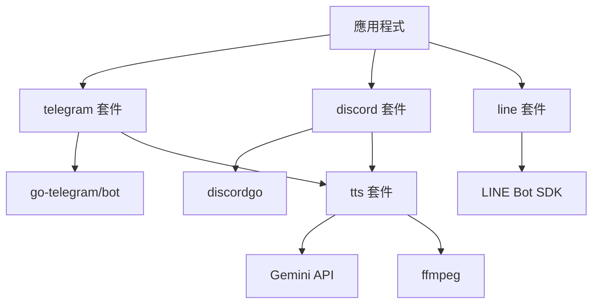
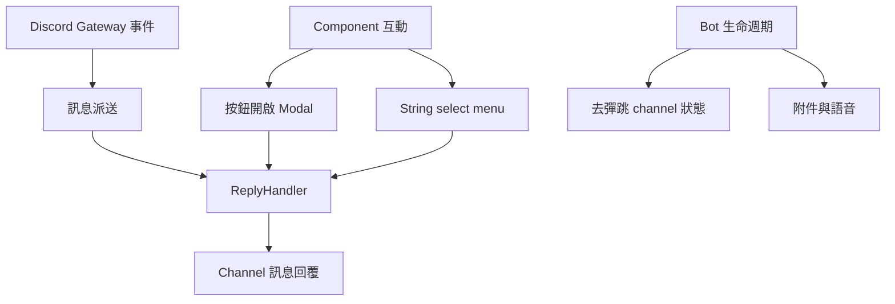
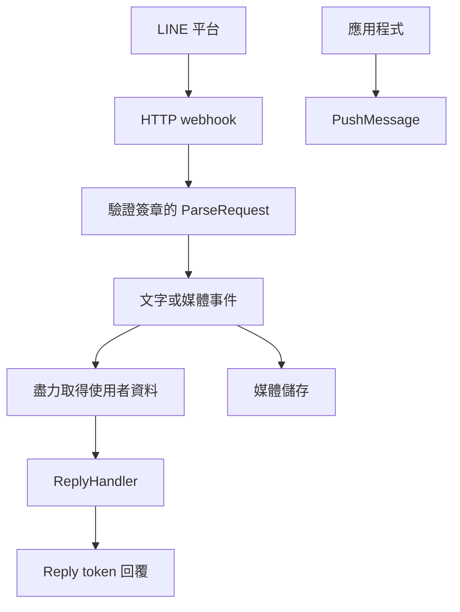
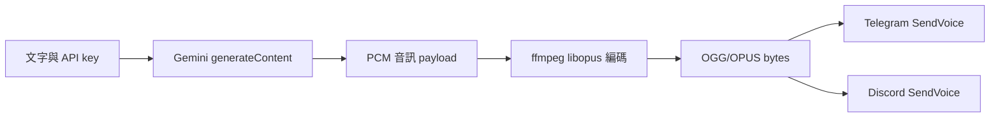
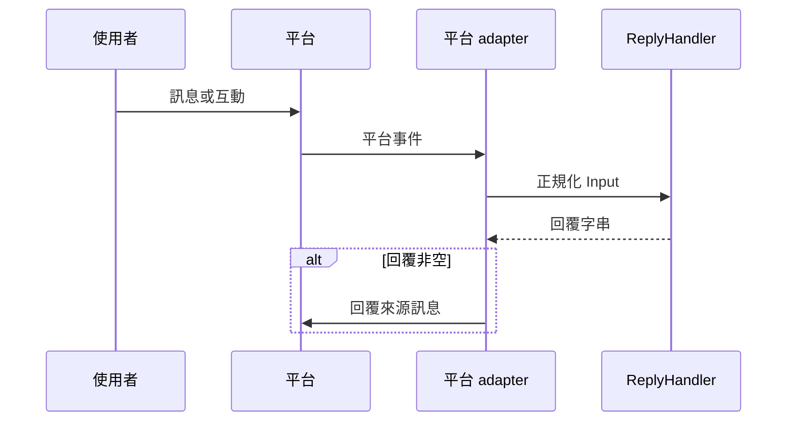
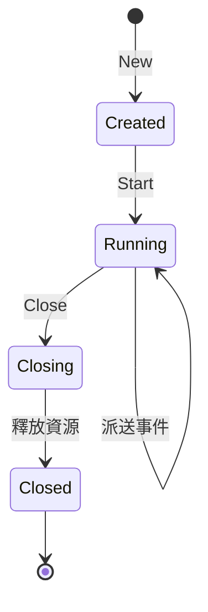

# go-bot - 架構

> 返回 [README](./README.zh.md)

## 概覽

## 模組：Telegram

Telegram adapter 負責 long-polling 生命週期、同步派送 update，並將平台功能對應至套件 API。

```mermaid
graph TB
    Update[Telegram Update] --> Dispatch[派送器]
    Dispatch --> Handler[ReplyHandler]
    Handler --> Reply[SendMessage 回覆]
    Dispatch --> Callback[Callback 派送]
    Callback --> Single[單選]
    Callback --> Multi[多選狀態]
    Bot[Bot 生命週期] --> Poll[Long polling]
    Bot --> Status[去彈跳狀態訊息]
    Bot --> Media[檔案與圖片 helper]
```

## 模組：Discord

Discord adapter 管理 Gateway session，並使用 Discord 原生 component 完成互動流程。

## 模組：LINE

LINE adapter 執行 inbound HTTP webhook server，API 範圍限定於回覆、PushMessage 與媒體儲存。

## 模組：文字轉語音

TTS 套件會將文字請求轉為可供 Telegram 與 Discord 傳送 helper 使用的音訊 bytes。

## 資料流

## 狀態機

***

©️ 2026 [邱敬幃 Pardn Chiu](https://www.linkedin.com/in/pardnchiu)
