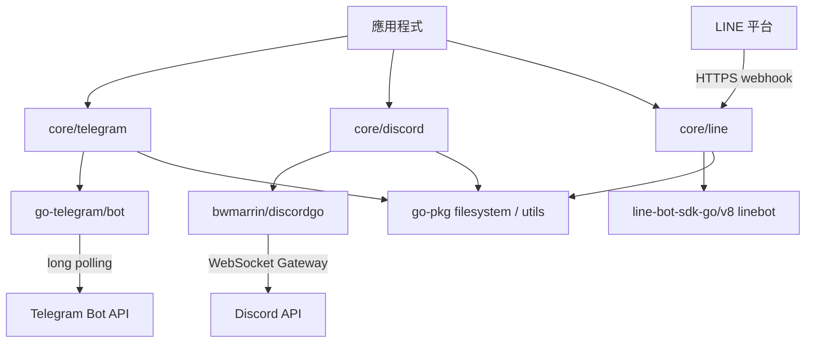
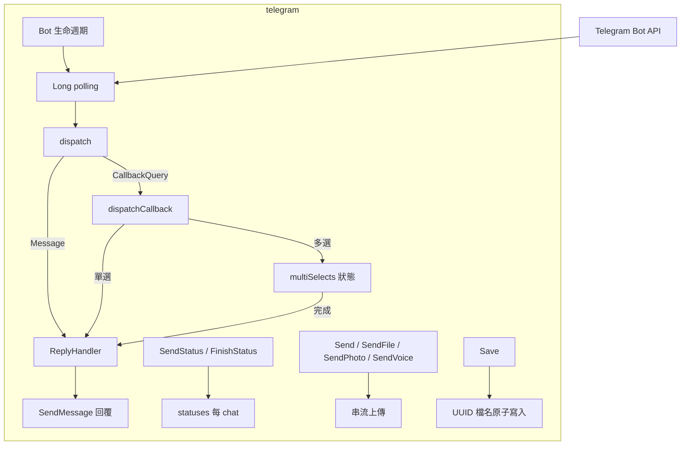
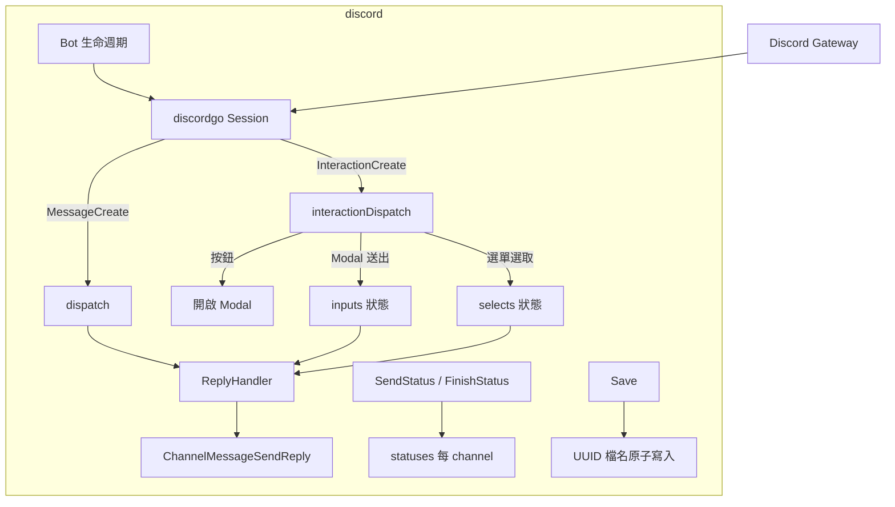
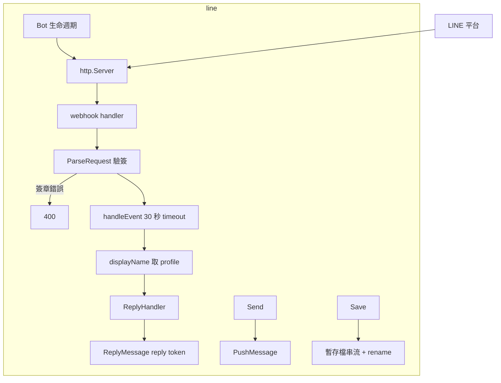
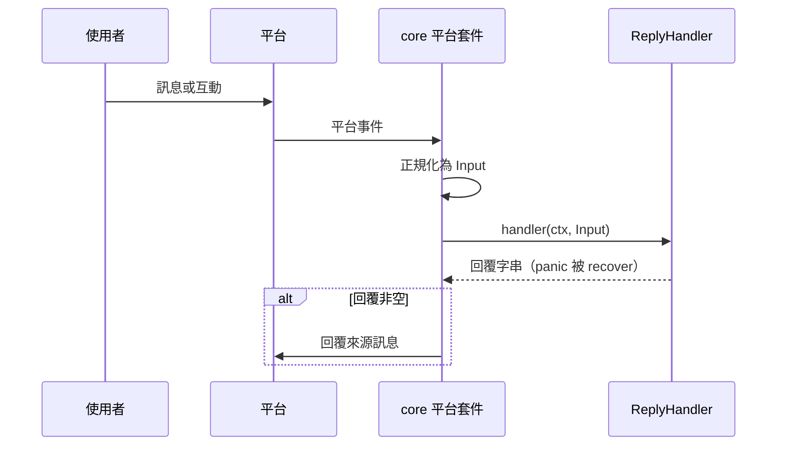
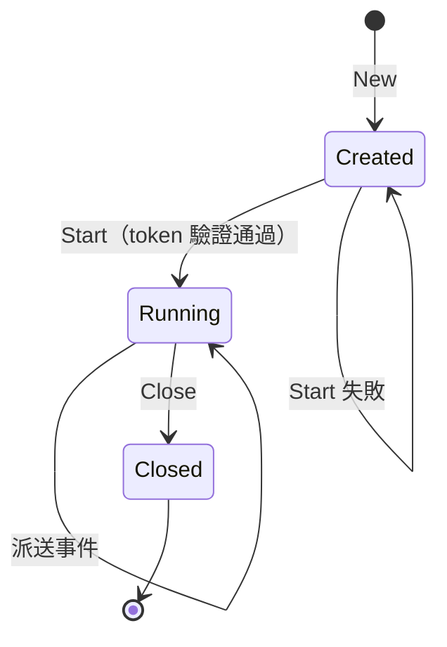
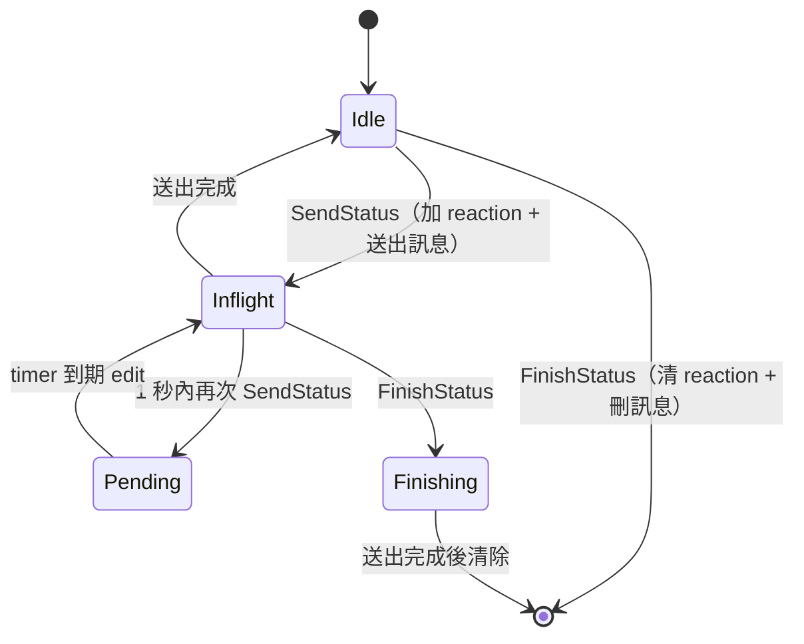

# go-bot - 架構

最後更新：2026-10-06

> 返回 [README](./README.zh.md)

## 概覽

三個平台套件彼此獨立、不共用內部套件，對外一致的只有 `New`／`Start`／`Close`／`Status` 生命週期與「`Reply(handler)` 回傳非空字串即回覆」的慣例。

```mermaid
graph TB
    App[應用程式] --> TG[core/telegram]
    App --> DC[core/discord]
    App --> LN[core/line]
    TG --> TGSDK[go-telegram/bot]
    DC --> DGSDK[bwmarrin/discordgo]
    LN --> LNSDK[line-bot-sdk-go/v8 linebot]
    TG --> PKG[go-pkg filesystem / utils]
    DC --> PKG
    LN --> PKG
    TGSDK -->|long polling| TelegramAPI[Telegram Bot API]
    DGSDK -->|WebSocket Gateway| DiscordAPI[Discord API]
    LineAPI[LINE 平台] -->|HTTPS webhook| LN
```

## 模組：core/telegram

Telegram adapter 負責 long polling 生命週期、同步派送 update，並以 inline keyboard／ForceReply 提供互動元件。

```mermaid
graph TB
    subgraph telegram
        Bot[Bot 生命週期] --> Poll[Long polling]
        Poll --> Dispatch[dispatch]
        Dispatch -->|Message| Handler[ReplyHandler]
        Dispatch -->|CallbackQuery| Callback[dispatchCallback]
        Callback -->|單選| Handler
        Callback -->|多選| Multi[multiSelects 狀態]
        Multi -->|完成| Handler
        Handler --> Reply[SendMessage 回覆]
        Status[SendStatus / FinishStatus] --> Statuses[statuses 每 chat]
        Media[Send / SendFile / SendPhoto / SendVoice] --> Upload[串流上傳]
        Save[Save] --> Disk[UUID 檔名原子寫入]
    end
    API[Telegram Bot API] --> Poll
```

## 模組：core/discord

Discord adapter 管理 Gateway session，並以 Discord 原生 component 完成互動流程。

```mermaid
graph TB
    subgraph discord
        Bot[Bot 生命週期] --> Session[discordgo Session]
        Session -->|MessageCreate| Dispatch[dispatch]
        Session -->|InteractionCreate| Interaction[interactionDispatch]
        Dispatch --> Handler[ReplyHandler]
        Interaction -->|按鈕| Modal[開啟 Modal]
        Interaction -->|Modal 送出| Inputs[inputs 狀態]
        Interaction -->|選單選取| Selects[selects 狀態]
        Inputs --> Handler
        Selects --> Handler
        Handler --> Reply[ChannelMessageSendReply]
        Status[SendStatus / FinishStatus] --> Statuses[statuses 每 channel]
        Save[Save] --> Disk[UUID 檔名原子寫入]
    end
    Gateway[Discord Gateway] --> Session
```

## 模組：core/line

LINE adapter 執行 inbound HTTP webhook server，範圍限定於回覆、PushMessage 與媒體儲存。

```mermaid
graph TB
    subgraph line
        Bot[Bot 生命週期] --> Server[http.Server]
        Server --> Webhook[webhook handler]
        Webhook --> Parse[ParseRequest 驗簽]
        Parse -->|簽章錯誤| R400[400]
        Parse --> Event[handleEvent 30 秒 timeout]
        Event --> Profile[displayName 取 profile]
        Profile --> Handler[ReplyHandler]
        Handler --> Reply[ReplyMessage reply token]
        Send[Send] --> Push[PushMessage]
        Save[Save] --> Disk[暫存檔串流 + rename]
    end
    LINE[LINE 平台] --> Server
```

## 資料流

```mermaid
sequenceDiagram
    participant User as 使用者
    participant Platform as 平台
    participant Adapter as core 平台套件
    participant Handler as ReplyHandler
    User->>Platform: 訊息或互動
    Platform->>Adapter: 平台事件
    Adapter->>Adapter: 正規化為 Input
    Adapter->>Handler: handler(ctx, Input)
    Handler-->>Adapter: 回覆字串（panic 被 recover）
    alt 回覆非空
        Adapter->>Platform: 回覆來源訊息
    end
```

## 狀態機

### Bot 生命週期

```mermaid
stateDiagram-v2
    [*] --> Created: New
    Created --> Running: Start（token 驗證通過）
    Created --> Created: Start 失敗
    Running --> Running: 派送事件
    Running --> Closed: Close
    Closed --> [*]
```

### 狀態訊息（SendStatus / FinishStatus）

```mermaid
stateDiagram-v2
    [*] --> Idle
    Idle --> Inflight: SendStatus（加 reaction + 送出訊息）
    Inflight --> Pending: 1 秒內再次 SendStatus
    Pending --> Inflight: timer 到期 edit
    Inflight --> Idle: 送出完成
    Idle --> [*]: FinishStatus（清 reaction + 刪訊息）
    Inflight --> Finishing: FinishStatus
    Finishing --> [*]: 送出完成後清除
```

***

©️ 2026 [邱敬幃 Pardn Chiu](https://www.linkedin.com/in/pardnchiu)
